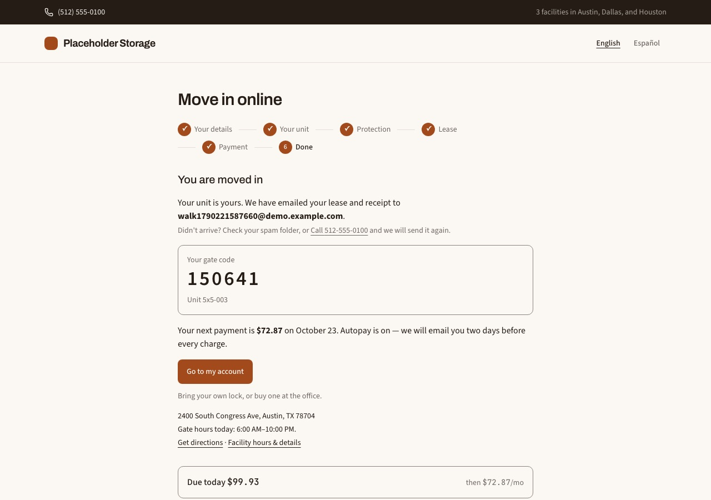
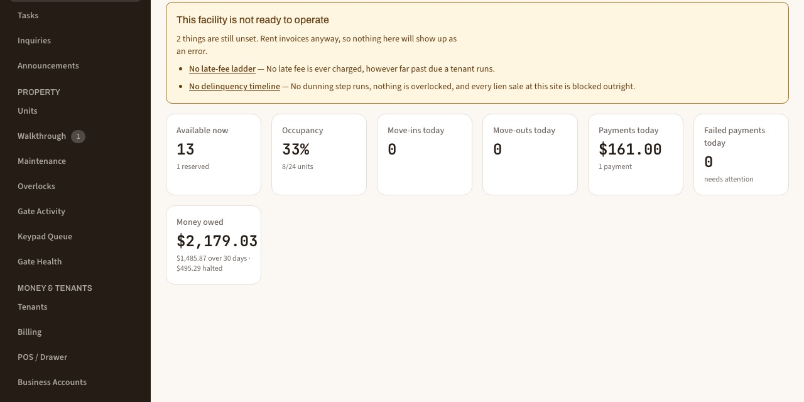

# Project Write-Up: Storage Business

> Portfolio write-up. Update the "Last synced" line every time the repo changes materially. A stale write-up is worse than none.

**Repo:** https://github.com/shanelabountyai/self-storage-app (private)
**Live demo:** https://storage.labintelligence.co (shared password, demo data only, seeded with no logins). The full demo runs locally from [`docs/DEMO.md`](docs/DEMO.md)
**Built with:** Claude Code + Next.js (App Router), TypeScript, Postgres + Prisma, Stripe, Tailwind CSS, Vercel
**Status:** Shipped 2026-09-21 · Last synced: 2026-09-23
**Exec brief (non-technical):** https://claude.ai/artifact/AeGQeP4BE4Ljye66GfrJAf

---

## The Business Problem

A self-storage operator is holding a customer's belongings, and state lien law lets them sell those belongings to recover unpaid rent. Selling is lawful only if a precise sequence of notices went out, by the right method, on the right days. Small operators run this from a counter, a phone, paper leases and a binder, with the website from one vendor and the gate keypad from another. The renter looking at ten at night rents from whoever lets them finish online. A late bill gets chased only when someone remembers to look.

## What I Built

- **Renters can rent a unit online from start to finish:** search, unit choice, lease and e-signature, protection plan, card payment and a working gate code, all without visiting an office.
- **The office runs the counter:** cash, check and card at the desk, a drawer count and a deposit slip, receipts with gapless numbering, business accounts where one payer covers several units, and payment plans that pause collections.
- **Delinquency runs as a legal process, not reminder emails.** The gate code is suspended when rent is late and comes back by itself on payment. Overlock, pre-lien, lien and auction steps each require proof before the next one opens. The operator configures each step for their facility and the product ships no default.
- **Pricing:** web and in-store rates, street-rate changes, and rate increases for existing tenants with notice letters and owner approval.
- **Several facilities** with staff roles scoped to each site, a month-end close that freezes last month's figures, and mandatory two-factor sign-in for every staff account.
- **Tenants get a portal in English and Spanish:** balance, autopay, payment, documents and messages.
- **One design language across the public site, the tenant portal and the staff screens**, built from a design kit and checked against WCAG 2.1 AA with automated scans, plus layout checks at 320px, 200% zoom and forced text spacing.

*Both screens were captured on 2026-09-23 from a production build, after the visual redesign (B-363 to B-370).*

## How It's Built

It is an npm-workspaces monorepo. `apps/web` holds the Next.js app, `packages/core` holds the domain rules, and `packages/db` holds the Prisma schema and seeds. The schema has 97 models across 123 migrations, using the entity names from the master PRD (Facility, Unit, UnitType, Tenant, Lease, Invoice, Payment, AccessCredential, Lead and supporting entities). The ledger is the source of truth. Invoices and payments are the app's own rows, Stripe only moves money, and an hourly job flags any lease where the ledger and the open invoices disagree. Side effects (emails, gate changes, tasks) go through an event outbox with one catalog of events and one dispatcher. Gate hardware sits behind an adapter, and the only implementation is a simulator with a software keypad.

**Key design decisions** (the full log is [`docs/prds/07-decisions.md`](docs/prds/07-decisions.md): 151 entries, each settled once)

| Decision | Alternative considered | Why I chose it |
|---|---|---|
| Ledger-driven Stripe PaymentIntents (D-6) | Stripe Billing subscriptions | Delinquency, late fees and lien eligibility are computed from the ledger. If Stripe owned the invoices, the legal clock would run on someone else's state machine. |
| Money is stored as integer cents | Decimals or floats | Rounding drift in a balance that later becomes evidence in a lien dispute is not acceptable. |
| No default delinquency timeline. An unconfigured facility runs no collections, and the dashboard says so | A sensible Texas default | A default is a legal claim about a state the software was never told about. Storage is sold state by state (D-10). |
| Lien notices are generated documents, mailed, kept as printed, and English only | Email them, and translate them like the other messages | Email carries no proof of receipt that survives a dispute. A translation is a second legal text nobody reviewed. The courtesy email that goes with the notice is translated. |
| Staff can view a tenant's account as the tenant sees it, read-only, enforced at the request edge | The write mode the spec asked for | Anything a support session does as the tenant would enter the record as the tenant's own act. I deleted the write permission rather than switching it off. |
| The audit log is append-only, enforced by a Postgres trigger | Append-only by application convention | Nothing in the app can edit or delete a line of it, including a bug and including me. This has a cost, covered under *Defects Found*. |
| A move-in completes from the Stripe webhook | Complete it on the browser's return redirect | If the renter closes the tab at the wrong moment, the unit and the payment are still recorded. |
| "What does this tenant owe" has one answer, `outstandingCents` | Each consumer filters its own query | A dozen places answered it separately, and they had drifted. See *The Hardest Bug*. |

## Skills Learned / Functions Unlocked

- **Ledger accounting and payment allocation.** A payment is applied to invoices by rule, and an account payment settles only that account's units. The shared delinquency figure is computed in one place. See [`apps/web/lib/billing/allocation.ts`](apps/web/lib/billing/allocation.ts) and [`packages/core/metrics/delinquency.ts`](packages/core/metrics/delinquency.ts).
- **Compliance rules as configuration.** Each facility's delinquency timeline, late-fee ladder and holds are data. Protective holds (bankruptcy, active duty, a deceased tenant, a payment plan) halt specific parts of the pipeline, declared in one catalog. See [`packages/core/holds/catalog.ts`](packages/core/holds/catalog.ts), [`packages/core/delinquency/`](packages/core/delinquency/) and [`apps/web/lib/admin/facility-readiness.ts`](apps/web/lib/admin/facility-readiness.ts).
- **Concurrency on shared inventory.** Two renters cannot claim the same unit, because the claim uses `FOR UPDATE SKIP LOCKED` with checkout locks and reservation holds that expire. Receipt numbers are gapless per drawer. See [`apps/web/lib/checkout/session.ts`](apps/web/lib/checkout/session.ts) and [`apps/web/lib/reservations/reserve.ts`](apps/web/lib/reservations/reserve.ts).
- **Event-driven side effects and bilingual messaging.** An outbox with a typed event catalog feeds seeded message templates in English and Spanish, with quiet hours and consent rules. See [`packages/core/events/`](packages/core/events/) and [`apps/web/lib/i18n/`](apps/web/lib/i18n/).
- **Security that passes a vendor review.** It has read-only support sessions, a database-enforced audit log, and mandatory two-factor sign-in with no superuser bypass. The e2e suite also signs in with a real second factor. See [`apps/web/lib/impersonation/guard.ts`](apps/web/lib/impersonation/guard.ts) and [`packages/db/prisma/migrations/20260730174727_audit_log_append_only/`](packages/db/prisma/migrations/20260730174727_audit_log_append_only/).
- **WCAG 2.1 AA as an acceptance criterion.** Every customer-facing item carried accessibility criteria when it was written, and the e2e suite runs axe scans at phone and desktop widths.

## The Hardest Bug

**Voided invoices were still being chased.** When staff void an invoice, the row is kept and marked `void` instead of deleted, because the history is evidence. Its `totalCents` and `amountPaidCents` stay untouched for the same reason. In B-338 I was building the screen that re-issues a corrected bill, and the test for it would not pass. The reissued invoice was dated today, yet the late-fee ladder still charged a step as if the tenant had been late for weeks.

The cause was not in the new code. About a dozen consumers each computed what a tenant owes from their own unfiltered `lease.invoices` query, and none of them excluded `void` or `uncollectible`. So the late-fee ladder charged fees on cancelled bills, and `daysPastDue` counted from them. A rent-only dunning timeline sent reminders about them, and the gate-suspension check read the same figure. A write-off had the same shape. Every one of those consumers passed its own tests, because each test built fixtures that only contained live invoices.

The fix was one guard in the shared `outstandingCents`, which returns 0 for those two statuses. It went there instead of into a filter per query, because the shared function was where every consumer already routed. Adding `status` to the `UnpaidInvoice` type made the typechecker name all twelve queries that had to select it. I proved the fix by mutation: with the guard removed, the new test's late-fee assertion fails (`expected 1 to be +0`).

**What I'd instrument next time:** one property test that voids a random invoice on a delinquent lease and asserts that every delinquency consumer's figure drops by the same amount. The bug was a disagreement *between* modules, and only a test that checks across them can catch that kind of bug.

## Defects Found

Each of these cost a debugging pass. The lesson from each is written into the repo's `CLAUDE.md`, so the next session does not repeat it.

- **Production served a 200 on `/` and a 500 everywhere else, for a day.** Most pages are prerendered at build time, so they rendered fine. Next.js had bundled the Prisma client into a chunk, away from its native query engine, and every runtime query threw. The fix was `serverExternalPackages: ['@prisma/client']` plus Linux `binaryTargets`. Since then, deploys get smoke-tested on a dynamic route.
- **Raw SQL read a different schema than the ORM wrote.** The test suite sets `schema=storage_test`, but Prisma does not set `search_path` from that parameter. So the unit claim's `FOR UPDATE SKIP LOCKED` and the gapless numbering queried `public`, while the test fixtures went to `storage_test`. Scoping raw SQL took a second parameter (`options=-c search_path=`).
- **The command for adding a migration offered to drop the cloud database.** `db:migrate` pointed at the Neon dev branch. Because that branch had none of the migrations, `migrate dev` offered to reset the schema, one keystroke from dropping it. Local development now authors migrations against local Postgres. The only script that writes to Neon uses `migrate deploy`, which cannot drop anything.
- **Some tests failed only at night.** Marketing messages are refused during quiet hours, judged by the facility's local wall clock. Three suites passed between 8am and 9pm Central and failed outside that window, which looked exactly like a broken message sender. They now pin the clock with `vi.setSystemTime`.
- **The append-only audit log blocked test cleanup permanently.** Its trigger refuses `TRUNCATE`, and it holds a RESTRICT foreign key to `facility`. No test suite could reclaim a facility it had audit-logged against, and the test schema quietly grew to 13,106 facilities. The remedy is a one-command schema rebuild (`db:reset-test`).
- **Found in the final demo walk, then fixed (B-347 to B-349):** the lease quoted a $20 late fee from a table the fee engine never reads, `--font-sans` referred to itself so every page fell back to the browser's serif, and a bare `/portal/pay` told a one-unit tenant that their unit was not found. The lease now reads the same ladder the fee engine does, and says so when no late fee is charged.

## What I'd Do Differently

- **One source per fact, from the first day.** B-347 has the same shape as the hardest bug: two tables both answer "what is the late fee", and the lease reads the wrong one. I'd now treat any second place that computes a business fact as a defect, even while the two places still agree.
- **Give every behaviour-changing setting its control in the same item.** Five settings (billing policy, invoice lead days, move-in proration, payment retry days, the late-fee ladder) shipped reachable only from a database client, and it took two separate clean-up passes to add their forms.
- **Talk to a real operator before the third review round.** The domain knowledge came from published practice, state lien law, and review passes by AI agents briefed as an operator, a UX designer and an accessibility specialist. It is desk research, and the legal text has not been reviewed by an attorney.

## By the Numbers

- **Built in 56 calendar days** (2026-07-30 to 2026-09-23): 950 commits, 390 backlog rows marked done, and one `docs/PROGRESS.md` entry per item recording what it built, what it decided and what it left behind.
- **4,729 unit and database tests** (4,721 passed and 8 skipped on 2026-09-23) across 291 test files. **1,698 end-to-end tests** across 27 Playwright spec files, run at phone and desktop widths against a production build.
- About 143,000 lines of application TypeScript and 88,000 lines of tests.
- 97 data models, 123 migrations, and 151 recorded product decisions.
- Eleven review rounds by operator, UX and accessibility agents. Round nine's findings became backlog items B-329 to B-346 and 31 were declined; round eleven's became B-371 to B-382. Every refusal is on record with its reason.
- **What is not real:** the facilities and tenants are seeded, cards run in Stripe test mode, the gate is simulated, and SMS was never switched on because carrier registration was never approved.

---

*Part of my Claude Code build log: https://claude.ai/artifact/28KeGV3xfBwcBuoMEQjFMj*
